# GPU Developer Servers Infrastructure

OpenTofu configuration for PyTorch GPU development servers using AWS EKS with Kubernetes pod scheduling.

> ## 🚨 CRITICAL: OPENTOFU ONLY - NEVER USE TERRAFORM
>
> **⚠️ THIS INFRASTRUCTURE EXCLUSIVELY USES OPENTOFU ⚠️**
>
> **SEVERE WARNING:** Mixing Terraform and OpenTofu will cause:
> - 🔥 **State file corruption** (incompatible formats)
> - 🔥 **Resource duplication and conflicts**
> - 🔥 **Data loss and infrastructure destruction**
> - 🔥 **Irreversible damage** requiring complete rebuild
>
> **MANDATORY REQUIREMENTS:**
> - ✅ **OpenTofu MUST be installed**: `brew install opentofu` (macOS) or https://opentofu.org/docs/intro/install/
> - ✅ **ALWAYS use `tofu` commands** - never `terraform`
> - ❌ **DO NOT proceed if OpenTofu is not available**
> - ❌ **NEVER run `terraform` commands on this infrastructure**
> - ⚠️ **If you accidentally use terraform, STOP IMMEDIATELY and report it**
>
> **Verify Before Proceeding:**
> ```bash
> # Check OpenTofu is installed
> tofu version  # Should show: OpenTofu v1.8+
>
> # Ensure terraform is NOT used
> which terraform && echo "⚠️  WARNING: Do NOT use terraform on this project!"
>
> # SAFETY CHECK: Run this before ANY infrastructure changes
> if ! command -v tofu &> /dev/null; then
>     echo "❌ ERROR: OpenTofu not installed. Cannot proceed safely."
>     echo "Install: brew install opentofu"
>     exit 1
> fi
> ```
>
> **What to Use:**
> ```bash
> tofu init      # ✅ Correct
> tofu plan      # ✅ Correct
> tofu apply     # ✅ Correct
> tofu output    # ✅ Correct
>
> terraform *    # ❌ NEVER - Will destroy infrastructure
> ```

## Quick Start

### 1. Test Environment (Default)

Deploy to us-west-1 with 2x T4 instances for cost-effective testing:

```bash
tofu init
tofu apply
# This deploys to us-west-1 with 2x g4dn.12xlarge instances (8x T4 GPUs total)
```

### 2. Production Environment

Deploy to us-east-2 with A100 instances for production workloads:

```bash
tofu init
tofu apply -var-file="prod.tfvars"
# This deploys to us-east-2 with 2x p4d.24xlarge instances (16x A100 GPUs total)
```

## Environment Configurations

| Environment | Region | Command | Instance Type | GPU Type | Total GPUs | Cost/hour |
|-------------|--------|---------|---------------|----------|------------|-----------|
| **Test (default)** | us-west-1 | `tofu apply` | g4dn.12xlarge | T4 | 8 | ~$7.82 |
| **Production** | us-east-2 | `tofu apply -var-file="prod.tfvars"` | p4d.24xlarge | A100 | 16 | ~$49.54 |

**Test Environment Features:**
- Cost-effective T4 GPUs for development and testing
- Reduced capacity to minimize costs
- Same functionality as production

**Production Environment Features:**
- High-performance A100 GPUs for production workloads
- Full GPU type support (T4/A100/H100/H200/B200)
- Current live setup

## Configuration Options

### Customization Variables

```bash
# Override instance type
export TF_VAR_instance_type="g4dn.12xlarge"

# Override instance count
export TF_VAR_gpu_instance_count=2

# Override region
export TF_VAR_aws_region="us-east-2"
```

## Development - Connect to Kubernetes

To debug pods and services, configure kubectl to connect to your EKS cluster:

```bash
# Install kubectl (macOS)
brew install kubectl

# Configure kubectl for your EKS cluster
# For test environment (us-west-1):
aws eks update-kubeconfig --region us-west-1 --name pytorch-gpu-dev-cluster

# For production environment (us-east-2):
aws eks update-kubeconfig --region us-east-2 --name pytorch-gpu-dev-cluster

# Test connectivity
kubectl get nodes
kubectl get pods -n gpu-dev
kubectl get svc -n gpu-dev

# Debug a specific pod
kubectl logs <pod-name> -n gpu-dev
kubectl exec -it <pod-name> -n gpu-dev -- /bin/bash
```

## Architecture

### System Overview

```mermaid
---
title: GPU Developer Servers Architecture
---
flowchart TB
    CLI(("🖥️ GPU Dev CLI<br/>Python Tool")) --> |Reserve/Cancel| SQS{"📬 SQS Queue<br/>gpu-reservation-queue"}
    CLI --> |Query Status| DDB[("💾 DynamoDB<br/>Reservations Table")]

    SQS --> |Process Messages| LAMBDA1(["⚡ Reservation Processor<br/>Lambda Function"])
    SCHED(["⏰ CloudWatch Events<br/>Every 1 minute"]) --> |Queue Management| LAMBDA1

    LAMBDA1 --> |Update Status| DDB
    LAMBDA1 --> |Create/Delete Pods| EKS[["☸️ EKS Cluster<br/>GPU Nodes"]]
    LAMBDA1 --> |Query Capacity| EKS

    SCHED2(["⏰ CloudWatch Events<br/>Every 5 minutes"]) --> |Expiry Check| LAMBDA2(["⚡ Reservation Expiry<br/>Lambda Function"])
    LAMBDA2 --> |Check/Update| DDB
    LAMBDA2 --> |Cleanup Pods| EKS

    EKS --> |SSH Access| PODS(("🔧 GPU Dev Pods<br/>NodePort Services"))
    DEVS(("👩‍💻 Developers")) --> |SSH| PODS

    %% AWS Orange theme colors
    style CLI fill:#FF9900,stroke:#232F3E,stroke-width:2px,color:#fff
    style SQS fill:#FF9900,stroke:#232F3E,stroke-width:2px,color:#fff
    style DDB fill:#3F48CC,stroke:#232F3E,stroke-width:2px,color:#fff
    style LAMBDA1 fill:#FF9900,stroke:#232F3E,stroke-width:2px,color:#fff
    style LAMBDA2 fill:#FF9900,stroke:#232F3E,stroke-width:2px,color:#fff
    style EKS fill:#326CE5,stroke:#232F3E,stroke-width:2px,color:#fff
    style PODS fill:#326CE5,stroke:#232F3E,stroke-width:2px,color:#fff
    style SCHED fill:#87CEEB,stroke:#232F3E,stroke-width:2px,color:#000
    style SCHED2 fill:#87CEEB,stroke:#232F3E,stroke-width:2px,color:#000
    style DEVS fill:#28A745,stroke:#232F3E,stroke-width:2px,color:#fff
```



### Component Details

#### 1. **CLI Tool** (`gpu-dev-cli`)

- **Commands**: `reserve`, `list`, `cancel`, `connect`, `status`, `config`
- **Authentication**: AWS credentials + GitHub SSH keys
- **Configuration**: Zero-config approach with `~/.config/gpu-dev/config.json`

#### 2. **SQS Queue System**

- **Primary Queue**: `gpu-reservation-queue` - handles reservation and cancellation requests
- **Dead Letter Queue**: `gpu-reservation-dlq` - failed messages after 3 retries
- **Message Types**:
  - `reservation` (default) - create new reservation
  - `cancellation` - cancel existing reservation

#### 3. **Lambda Functions**

##### Reservation Processor (`reservation_processor`)

**Triggers**:

- SQS messages (real-time processing)
- CloudWatch Events (every 1 minute for queue management)

**Responsibilities**:

- Process reservation requests from SQS
- Create Kubernetes pods with GPU allocation
- Manage queue positions and ETA updates
- Handle cancellation requests
- Real-time GPU capacity tracking via K8s API

##### Reservation Expiry (`reservation_expiry`)

**Triggers**: CloudWatch Events (every 5 minutes)

**Responsibilities**:

- Check for expired reservations
- Send warning notifications (30min, 15min, 5min before expiry)
- Clean up expired pods and services
- Cancel stale queued reservations (>5min old)

#### 4. **DynamoDB Tables**

##### Reservations Table

**Primary Key**: `reservation_id`
**Indexes**:

- `StatusIndex` - Query by status (active, queued, pending, etc.)
- `UserIndex` - Query by user_id

**Schema**:

```json
{
  "reservation_id": "uuid-string",
  "user_id": "aws-username",
  "github_user": "github-username",
  "gpu_count": 1-16,
  "status": "pending|queued|preparing|active|expired|cancelled|failed",
  "created_at": "2025-01-12T10:30:00.000Z",
  "expires_at": "2025-01-12T18:30:00.000Z",
  "launched_at": "2025-01-12T10:35:00.000Z",
  "reservation_ended": "2025-01-12T18:30:00.000Z",
  "duration_hours": 8.0,
  "pod_name": "gpu-dev-abc12345",
  "namespace": "gpu-dev",
  "ssh_command": "ssh -p 31234 dev@1.2.3.4",
  "node_port": 31234,
  "node_ip": "1.2.3.4",
  "queue_position": 3,
  "estimated_wait_minutes": 45,
  "last_queue_update": "2025-01-12T10:31:00.000Z",
  "failure_reason": "error message",
  "cancelled_at": "2025-01-12T11:00:00.000Z"
}
```

**Analytics Fields:**

- `launched_at`: When the pod was successfully started (for wait time analysis: `launched_at - created_at`)
- `reservation_ended`: When the reservation ended (cancelled/expired) for usage analysis
- Early cancellation detection: `reservation_ended < expires_at`

#### 5. **EKS Cluster**

- **Node Groups**: GPU-enabled EC2 instances (g4dn.12xlarge for testing, p5.48xlarge for production)
- **Namespace**: `gpu-dev` - dedicated namespace for reservation pods
- **Namespace**: `gpu-controlplane` - control plane infrastructure (PostgreSQL, registry cache)
- **NVIDIA Device Plugin**: Exposes GPU resources to Kubernetes scheduler
- **Networking**: Full internet access, DNS resolution, NodePort services for SSH

#### 6. **Node Management**

Nodes are managed via **OpenTofu Auto Scaling Groups (ASGs)** with Launch Templates:

```
OpenTofu (tofu apply)
    │
    ├── Launch Templates (user-data scripts with containerd/docker config)
    │       │
    │       └── AWS Auto Scaling Groups
    │               │
    │               ├── GPU ASGs (one per GPU type: t4, a100, h100, h200, etc.)
    │               │   └── min = max = desired (fixed size, no dynamic autoscaling)
    │               │
    │               └── CPU ASG (management nodes)
    │                   └── min=1, max=4, desired=2
```

**Key Points:**
- GPU ASGs have `min = max = desired` (fixed count from config)
- ASG auto-replaces unhealthy nodes
- User-data scripts baked into Launch Template, applied on instance boot
- To update node config: `tofu apply` → instance refresh

#### 7. **Registry Pull-Through Cache**

Internal Docker registry that caches images from ghcr.io:

- **Namespace**: `gpu-controlplane`
- **Service**: `registry-ghcr:5000`
- **Purpose**: Avoid ghcr.io authentication issues, improve pull times
- **Usage**: `registry-ghcr.gpu-controlplane.svc.cluster.local:5000/org/image:tag`

Nodes are configured to trust this HTTP registry via:
- containerd: `/etc/containerd/certs.d/registry-ghcr.../hosts.toml`
- Docker: `/etc/docker/daemon.json` with `insecure-registries`

#### 6. **Kubernetes Resources**

##### Pod Specification

- **Base Image**: `pytorch/pytorch:2.8.0-cuda12.9-cudnn9-devel`
- **GPU Allocation**: 1, 2, 4, 8, or 16 GPUs via `nvidia.com/gpu` resource requests
- **Init Container**: Sets up dev user and SSH keys from GitHub
- **Volumes**: `/home/dev` (user data), `/workspace` (shared storage, 100Gi)
- **Services**: NodePort service for SSH access (port range: 30000-32767)

### Message Flow

#### Reservation Creation

1. User runs `gpu-dev reserve --gpus 2 --hours 4`
2. CLI sends reservation message to SQS queue
3. CLI creates "pending" record in DynamoDB for immediate polling
4. CLI polls DynamoDB for status updates with real-time countdown
5. Reservation Processor Lambda triggered by SQS message
6. Lambda checks GPU availability via K8s API
7. If available: creates pod → status becomes "preparing" → "active"
8. If unavailable: status becomes "queued" with position and ETA

#### Queue Management (Every Minute)

1. CloudWatch triggers Reservation Processor Lambda
2. Lambda queries all "queued" and "pending" reservations
3. Lambda checks current GPU availability via K8s API
4. For each queued reservation:
   - If GPUs available: allocate and create pod
   - If not available: update queue position and ETA
5. ETAs calculated based on active reservation expiry times

#### Cancellation

1. User runs `gpu-dev cancel abc12345`
2. CLI sends cancellation message to SQS queue
3. Reservation Processor Lambda handles cancellation message
4. Lambda updates status to "cancelled" and cleans up pod if active

#### Expiry Management (Every 5 Minutes)

1. CloudWatch triggers Reservation Expiry Lambda
2. Lambda queries all "active" reservations
3. Sends warnings at 30min, 15min, 5min before expiry
4. Cleans up expired pods and updates status to "expired"
5. Cancels stale queued reservations (>5min old)

### GPU Resource Management

The system uses **Kubernetes-native GPU tracking** instead of manual allocation:

- **Real-time Capacity**: Queries K8s API for `nvidia.com/gpu` resources
- **Automatic Allocation**: K8s scheduler handles GPU assignment to pods
- **No State Drift**: GPU availability always reflects actual cluster state
- **Fault Tolerance**: Pod failures automatically free GPU resources

### Deployment Configuration

#### Test Environment (Default)

- **Region**: us-west-1
- **Instances**: 2x g4dn.12xlarge (4x T4 GPUs each = 8 total)
- **GPU Types**: T4 only (cost-effective testing)
- **Cost**: ~$7.82/hour
- **Usage**: `tofu apply`

#### Production Environment

- **Region**: us-east-2  
- **Instances**: 2x p4d.24xlarge (8x A100 GPUs each = 16 total)
- **GPU Types**: T4, A100, H100, H200, B200 (full support)
- **Cost**: ~$49.54/hour
- **Usage**: `tofu apply -var-file="prod.tfvars"`

## CLI Usage

The CLI connects to different regions based on environment variables.

### Production Environment (Default)

The CLI defaults to us-east-2 (production). No configuration needed:

```bash
# Configure your GitHub username for SSH access
gpu-dev config set github_user your-github-username

# Reserve GPUs (connects to us-east-2 production)
gpu-dev reserve --gpus 2 --hours 4

# List your reservations
gpu-dev list
```

### Test Environment

For the test environment (us-west-1), set the AWS region:

```bash
# Set region for test environment
export AWS_DEFAULT_REGION=us-west-1

# Now CLI commands connect to us-west-1 test environment
gpu-dev reserve --gpus 1 --hours 2  # T4 GPUs available
gpu-dev list

# Or set region for a single command
AWS_DEFAULT_REGION=us-west-1 gpu-dev reserve --gpus 1 --hours 2
```

### Region Selection Priority

The CLI determines which region to use in this order:

1. `AWS_REGION` environment variable
2. `AWS_DEFAULT_REGION` environment variable  
3. Hardcoded default: `us-east-2` (production)

## Node Management Operations

### Replace Nodes with Updated Config

When you update user-data scripts (e.g., containerd/docker config), nodes need to be replaced:

```bash
# 1. Apply OpenTofu to update launch templates
tofu apply

# 2. Cordon all nodes (prevent new scheduling)
for node in $(kubectl get nodes -o name); do
  kubectl cordon $node
done

# 3. Drain all nodes (evict pods)
for node in $(kubectl get nodes -o name); do
  kubectl drain $node --ignore-daemonsets --delete-emptydir-data --force --disable-eviction
done

# 4. Trigger instance refresh on ASGs
aws autoscaling start-instance-refresh \
  --region us-west-1 \
  --auto-scaling-group-name pytorch-gpu-dev-cpu-nodes \
  --preferences '{"MinHealthyPercentage": 0, "InstanceWarmup": 300}'

# 5. Monitor new nodes coming up
kubectl get nodes -w
```

### Force Delete All Pods (Bypass PDB)

If pods have PodDisruptionBudgets preventing drain:

```bash
# Delete all pods in specific namespaces
kubectl delete pods --all -n gpu-controlplane --force --grace-period=0
kubectl delete pods --all -n gpu-dev --force --grace-period=0
kubectl delete pods -n kube-system -l app=ebs-csi-controller --force --grace-period=0
kubectl delete pods -n kube-system -l k8s-app=kube-dns --force --grace-period=0
```

### List Auto Scaling Groups

```bash
aws autoscaling describe-auto-scaling-groups --region us-west-1 \
  --query 'AutoScalingGroups[].{Name:AutoScalingGroupName,Desired:DesiredCapacity}' \
  --output table
```

### Check Instance Refresh Status

```bash
aws autoscaling describe-instance-refreshes \
  --region us-west-1 \
  --auto-scaling-group-name pytorch-gpu-dev-cpu-nodes \
  --query 'InstanceRefreshes[0].{Status:Status,PercentComplete:PercentageComplete}'
```

## Control Plane Infrastructure

The `gpu-controlplane` namespace contains infrastructure services:

### PostgreSQL (Primary-Replica)

```bash
# Check PostgreSQL pods
kubectl get pods -n gpu-controlplane -l app=postgres

# Connect to PostgreSQL
kubectl exec -it postgres-primary-0 -n gpu-controlplane -- psql -U gpudev -d gpudev

# Check replication status
kubectl exec -it postgres-primary-0 -n gpu-controlplane -- psql -U gpudev -d gpudev -c "SELECT * FROM pg_stat_replication;"
```

### Registry Pull-Through Cache

```bash
# Check registry status
kubectl get pods -n gpu-controlplane -l app=registry-cache

# Test registry connectivity from a pod
kubectl run test-registry --rm -it --image=busybox -- wget -q -O- http://registry-ghcr.gpu-controlplane:5000/v2/
```

### API Service (Job Submission)

REST API for submitting GPU jobs with AWS IAM authentication.

```bash
# Get API URL
tofu output api_service_url

# Or via kubectl
kubectl get svc -n gpu-controlplane api-service-public \
  -o jsonpath='{.status.loadBalancer.ingress[0].hostname}'

# Check API service status
kubectl get pods -n gpu-controlplane -l app=api-service

# View API logs
kubectl logs -n gpu-controlplane -l app=api-service --tail=50

# Test health endpoint
URL=$(tofu output -raw api_service_url)
curl $URL/health | jq .

# View Swagger docs
echo "Open in browser: $URL/docs"
```

**Features:**
- AWS IAM-based authentication (SSOCloudDevGpuReservation role)
- Time-limited API keys (2-hour expiration)
- PGMQ-based job queue
- RESTful API with Swagger documentation
- Classic LoadBalancer (internet-facing)

**Documentation:**
- Full API docs: `api-service/README.md`
- Claude context: `CLAUDE.md`
