# GPU Developer Servers Infrastructure

OpenTofu configuration for PyTorch GPU development servers using AWS EKS with Kubernetes pod scheduling.

> ## 🚨 CRITICAL: OPENTOFU ONLY - NEVER USE TERRAFORM
>
> **⚠️ THIS INFRASTRUCTURE EXCLUSIVELY USES OPENTOFU ⚠️**
>
> **SEVERE WARNING:** Mixing Terraform and OpenTofu will cause:
> - 🔥 **State file corruption** (incompatible formats)
> - 🔥 **Resource duplication and conflicts**
> - 🔥 **Data loss and infrastructure destruction**
> - 🔥 **Irreversible damage** requiring complete rebuild
>
> **MANDATORY REQUIREMENTS:**
> - ✅ **OpenTofu MUST be installed**: `brew install opentofu` (macOS) or https://opentofu.org/docs/intro/install/
> - ✅ **ALWAYS use `tofu` commands** - never `terraform`
> - ❌ **DO NOT proceed if OpenTofu is not available**
> - ❌ **NEVER run `terraform` commands on this infrastructure**
> - ⚠️ **If you accidentally use terraform, STOP IMMEDIATELY and report it**
>
> **Verify Before Proceeding:**
> ```bash
> # Check OpenTofu is installed
> tofu version  # Should show: OpenTofu v1.8+
>
> # Ensure terraform is NOT used
> which terraform && echo "⚠️  WARNING: Do NOT use terraform on this project!"
>
> # SAFETY CHECK: Run this before ANY infrastructure changes
> if ! command -v tofu &> /dev/null; then
>     echo "❌ ERROR: OpenTofu not installed. Cannot proceed safely."
>     echo "Install: brew install opentofu"
>     exit 1
> fi
> ```
>
> **What to Use:**
> ```bash
> tofu init      # ✅ Correct
> tofu plan      # ✅ Correct
> tofu apply     # ✅ Correct
> tofu output    # ✅ Correct
>
> terraform *    # ❌ NEVER - Will destroy infrastructure
> ```
>
> **📖 Read the full explanation: [OPENTOFU_ONLY.md](OPENTOFU_ONLY.md)**

## Overview

This infrastructure provides on-demand GPU development servers through Kubernetes, with a REST API for job submission and AWS IAM-based authentication.

## System Architecture

**GPU Dev Infrastructure:**
```
CLI → API → PostgreSQL + PGMQ → K8s Job Processor Pod → K8s
```

**System Components:**
- ✅ **API Service**: REST API with AWS IAM authentication and CloudFront HTTPS
- ✅ **PostgreSQL + PGMQ**: Database for all state + message queue for job processing
- ✅ **CLI**: Python CLI tool using API exclusively
- ✅ **Job Processor Pod**: K8s pod that continuously processes jobs from PGMQ queue
- ✅ **Availability Updater CronJob**: Updates GPU availability + reconciles disk state from AWS (every 5 min)
- ✅ **Reservation Expiry CronJob**: Expires reservations and cleans up pods (every 5 min)

**User Workflow:**
1. Users authenticate with AWS credentials via `gpu-dev login`
2. CLI receives time-limited API key (2 hours, auto-refresh)
3. All CLI commands use API endpoints (reserve, list, cancel, extend, etc.)
4. API pushes jobs to PGMQ queue
5. Job Processor Pod polls queue and creates GPU dev server pods
6. Users connect to pods via SSH

## Quick Start

### 1. Test Environment (Default)

Deploy to us-west-1 with 2x T4 instances for cost-effective testing:

```bash
tofu init
tofu apply
# This deploys to us-west-1 with 2x g4dn.12xlarge instances (8x T4 GPUs total)
# Includes CloudFront distribution for HTTPS (takes 15-20 minutes to deploy)
```

**Note:** CloudFront distribution deployment takes 15-20 minutes to propagate globally. The API service will be available via HTTP immediately through the LoadBalancer, but HTTPS via CloudFront requires waiting for distribution deployment to complete.

### 2. Production Environment

Deploy to us-east-2 with A100 instances for production workloads:

```bash
tofu init
tofu apply -var-file="prod.tfvars"
# This deploys to us-east-2 with 2x p4d.24xlarge instances (16x A100 GPUs total)
```

## Environment Configurations

| Environment | Region | Command | Instance Type | GPU Type | Total GPUs | Cost/hour |
|-------------|--------|---------|---------------|----------|------------|-----------|
| **Test (default)** | us-west-1 | `tofu apply` | g4dn.12xlarge | T4 | 8 | ~$7.82 |
| **Production** | us-east-2 | `tofu apply -var-file="prod.tfvars"` | p4d.24xlarge | A100 | 16 | ~$49.54 |

**Test Environment Features:**
- Cost-effective T4 GPUs for development and testing
- Reduced capacity to minimize costs
- Same functionality as production

**Production Environment Features:**
- High-performance A100 GPUs for production workloads
- Full GPU type support (T4/A100/H100/H200/B200)
- Current live setup

## Configuration Options

### Customization Variables

```bash
# Override instance type
export TF_VAR_instance_type="g4dn.12xlarge"

# Override instance count
export TF_VAR_gpu_instance_count=2

# Override region
export TF_VAR_aws_region="us-east-2"
```

## Verify CloudFront Deployment

After running `tofu apply`, check CloudFront distribution status:

```bash
# Get the CloudFront URL
tofu output api_service_url
# Output: https://d1234567890abc.cloudfront.net

# Check distribution status (should be "Deployed")
aws cloudfront list-distributions \
  --query "DistributionList.Items[?Comment=='GPU Dev API Service - HTTPS endpoint'].{Domain:DomainName,Status:Status}" \
  --output table

# Test HTTPS endpoint (wait until Status = Deployed)
curl https://d1234567890abc.cloudfront.net/health
```

**Timeline:**
- **0-5 minutes**: LoadBalancer ready (HTTP works)
- **15-20 minutes**: CloudFront deployed (HTTPS works)

You can use the direct LoadBalancer URL immediately for testing, then switch to CloudFront URL once deployed.

## Development - Connect to Kubernetes

To debug pods and services, configure kubectl to connect to your EKS cluster:

```bash
# Install kubectl (macOS)
brew install kubectl

# Configure kubectl for your EKS cluster
# For test environment (us-west-1):
aws eks update-kubeconfig --region us-west-1 --name pytorch-gpu-dev-cluster

# For production environment (us-east-2):
aws eks update-kubeconfig --region us-east-2 --name pytorch-gpu-dev-cluster

# Test connectivity
kubectl get nodes
kubectl get pods -n gpu-dev
kubectl get svc -n gpu-dev

# Debug a specific pod
kubectl logs <pod-name> -n gpu-dev
kubectl exec -it <pod-name> -n gpu-dev -- /bin/bash
```

## Development - Building and Deploying Docker Images

### ⚠️ CRITICAL: Always Use OpenTofu for Docker Builds

**❌ WRONG - Do NOT manually build and push Docker images:**
```bash
# DON'T DO THIS:
cd api-service
docker build -t api-service:latest .
docker push $ACCOUNT_ID.dkr.ecr.us-east-2.amazonaws.com/api-service:latest

cd ../reservation-processor-service
docker build -t reservation-processor:latest .
docker push $ACCOUNT_ID.dkr.ecr.us-east-2.amazonaws.com/reservation-processor:latest
```

**Problems with manual builds:**
- ❌ ECR repository might not exist yet
- ❌ Wrong build context (Docker needs parent directory)
- ❌ Manual authentication required
- ❌ Kubernetes deployment won't auto-update
- ❌ Not idempotent or automated

**✅ CORRECT - Use OpenTofu with targets:**

```bash
cd terraform-gpu-devservers

# Build and deploy ALL services
tofu apply -auto-approve

# Or rebuild just the API service
tofu apply -target=null_resource.api_service_image

# Or rebuild just the reservation processor
tofu apply -target=null_resource.reservation_processor_image
```

**Why this is correct:**
- ✅ Ensures ECR repositories exist first
- ✅ Uses correct build context automatically
- ✅ Handles ECR authentication automatically
- ✅ Triggers Kubernetes deployment rollout
- ✅ Idempotent and safe for CI/CD
- ✅ Works the same locally and in automation

### Development Workflow

**When you change code:**

1. **Edit the service code** (e.g., `api-service/app/main.py`)
2. **Test locally if possible** (optional)
3. **Deploy via OpenTofu:**
   ```bash
   cd terraform-gpu-devservers
   tofu apply -target=null_resource.api_service_image
   ```
4. **Verify deployment:**
   ```bash
   kubectl rollout status -n gpu-controlplane deployment/api-service
   kubectl logs -n gpu-controlplane -l app=api-service --tail=50
   ```

### Available Targets

```bash
# API Service
tofu apply -target=null_resource.api_service_image

# Reservation Processor
tofu apply -target=null_resource.reservation_processor_image

# All services at once
tofu apply -auto-approve
```

## Architecture

### System Overview

```mermaid
---
title: GPU Developer Servers Architecture
---
flowchart TB
    CLI(("🖥️ GPU Dev CLI<br/>Python Tool")) --> |1. AWS IAM Auth| API["🌐 API Service<br/>(FastAPI + ALB)"]
    CLI --> |2. Submit Jobs| API

    API --> |Authenticate| AWS["☁️ AWS STS<br/>IAM Verification"]
    API --> |Store Users/Keys| PG[("🐘 PostgreSQL<br/>Users + Reservations")]
    API --> |Push Jobs| PGMQ[("📬 PGMQ Queue<br/>gpu_reservations")]

    JOBPROC["⚙️ Job Processor Pod<br/>(Pulling Model)"] --> |Poll & Consume| PGMQ
    JOBPROC --> |Read/Write State| PG
    JOBPROC --> |Create/Delete Pods| EKS[["☸️ EKS Cluster<br/>GPU Nodes"]]
    JOBPROC --> |Query Capacity| EKS

    EKS --> |SSH Access| PODS(("🔧 GPU Dev Pods<br/>NodePort Services"))
    DEVS(("👩‍💻 Developers")) --> |SSH| PODS

    %% Theme colors
    style CLI fill:#FF9900,stroke:#232F3E,stroke-width:2px,color:#fff
    style API fill:#FF9900,stroke:#232F3E,stroke-width:2px,color:#fff
    style AWS fill:#FF9900,stroke:#232F3E,stroke-width:2px,color:#fff
    style PG fill:#336791,stroke:#232F3E,stroke-width:2px,color:#fff
    style PGMQ fill:#336791,stroke:#232F3E,stroke-width:2px,color:#fff
    style JOBPROC fill:#326CE5,stroke:#232F3E,stroke-width:2px,color:#fff
    style EKS fill:#326CE5,stroke:#232F3E,stroke-width:2px,color:#fff
    style PODS fill:#326CE5,stroke:#232F3E,stroke-width:2px,color:#fff
    style DEVS fill:#28A745,stroke:#232F3E,stroke-width:2px,color:#fff
```



**Implementation Status:**
- ✅ PostgreSQL + PGMQ: Deployed and operational with all tables
- ✅ API Service: Deployed with AWS IAM auth and all endpoints
- ✅ CLI Integration: Uses API exclusively for all operations
- ✅ Job Processor Pod: Operational and processing jobs continuously

### Component Details

#### 1. **CLI Tool** (`gpu-dev-cli`)

- **Commands**: `reserve`, `list`, `cancel`, `connect`, `status`, `config`, `extend`, `login`, `avail`, `disk`
- **Authentication**: AWS IAM credentials → API key (2-hour expiration, auto-refresh)
- **Configuration**: `~/.config/gpu-dev/config.json` and `~/.gpu-dev/credentials`
- **SSH Keys**: Fetches from GitHub public keys
- **Status**: ✅ Fully integrated with API

#### 2. **API Service** (`api-service`)

- **Framework**: FastAPI (Python async web framework)
- **Location**: `gpu-controlplane` namespace
- **Endpoints**: 
  - **HTTPS (Primary)**: CloudFront distribution with AWS-managed SSL
  - **HTTP (Fallback)**: Classic LoadBalancer (direct access)
- **Authentication**: AWS IAM STS verification
- **Required Role**: `SSOCloudDevGpuReservation`
- **API Key TTL**: 2 hours (configurable via `API_KEY_TTL_HOURS`)
- **Documentation**: Swagger UI at `/docs`

**Key Endpoints:**
- `POST /v1/auth/aws-login` - Exchange AWS credentials for API key
- `POST /v1/jobs/submit` - Submit GPU reservation job to PGMQ
- `GET /v1/jobs/{job_id}` - Get job status and connection info
- `GET /v1/jobs` - List user's jobs with filtering
- `POST /v1/jobs/{job_id}/cancel` - Cancel a job
- `POST /v1/jobs/{job_id}/extend` - Extend job duration
- `POST /v1/jobs/{job_id}/jupyter/enable` - Enable Jupyter Lab
- `POST /v1/jobs/{job_id}/users` - Add SSH users
- `GET /v1/gpu/availability` - Real-time GPU availability
- `GET /v1/cluster/status` - Overall cluster status
- `POST /v1/disks` - Create persistent disk
- `GET /v1/disks` - List disks
- `POST /v1/keys/rotate` - Rotate API key
- `GET /health` - Health check

**HTTPS Configuration:**
- CloudFront provides HTTPS with AWS-managed certificate
- No custom domain required
- Free SSL for `*.cloudfront.net` domain
- Automatic HTTPS redirect
- No caching (configured for API traffic)

**Status**: ✅ Deployed and operational

#### 3. **PostgreSQL + PGMQ**

- **Database**: PostgreSQL 16 with PGMQ extension
- **Deployment**: Primary-replica setup in `gpu-controlplane` namespace
- **Storage**: 100Gi gp3 PVC per instance
- **Services**: 
  - `postgres-primary:5432` (read-write)
  - `postgres-replica:5432` (read-only)

**Tables:**

##### `api_users` - User Accounts
```sql
CREATE TABLE api_users (
    user_id SERIAL PRIMARY KEY,
    username VARCHAR(255) UNIQUE NOT NULL,
    email VARCHAR(255),
    created_at TIMESTAMP WITH TIME ZONE DEFAULT CURRENT_TIMESTAMP,
    is_active BOOLEAN DEFAULT true
);
```

##### `api_keys` - Time-Limited API Keys
```sql
CREATE TABLE api_keys (
    key_id SERIAL PRIMARY KEY,
    user_id INTEGER REFERENCES api_users(user_id) ON DELETE CASCADE,
    key_hash VARCHAR(128) NOT NULL UNIQUE,
    key_prefix VARCHAR(16) NOT NULL,
    created_at TIMESTAMP WITH TIME ZONE DEFAULT CURRENT_TIMESTAMP,
    expires_at TIMESTAMP WITH TIME ZONE,
    last_used_at TIMESTAMP WITH TIME ZONE,
    is_active BOOLEAN DEFAULT true,
    description TEXT
);
```

##### `reservations` - GPU Reservations
```json
{
  "reservation_id": "uuid-string",
  "user_id": integer (FK to api_users),
  "github_user": "github-username",
  "gpu_count": 1-16,
  "gpu_type": "t4|l4|a100|h100|h200|b200",
  "status": "pending|queued|preparing|active|expired|cancelled|failed",
  "created_at": "2025-01-12T10:30:00.000Z",
  "expires_at": "2025-01-12T18:30:00.000Z",
  "launched_at": "2025-01-12T10:35:00.000Z",
  "reservation_ended": "2025-01-12T18:30:00.000Z",
  "duration_hours": 8.0,
  "pod_name": "gpu-dev-abc12345",
  "namespace": "gpu-dev",
  "ssh_command": "ssh -p 31234 dev@1.2.3.4",
  "node_port": 31234,
  "node_ip": "1.2.3.4",
  "queue_position": 3,
  "estimated_wait_minutes": 45,
  "failure_reason": "error message"
}
```

**PGMQ Queues:**
- `gpu_reservations` - Job queue for reservation requests
- `disk_operations` - Queue for disk create/delete operations

**Status**: ✅ Deployed with complete schema

#### 4. **Job Processor Pod**

**Architecture**: Long-running Kubernetes deployment in `gpu-controlplane` namespace

**Responsibilities**:
- Continuously poll PGMQ `gpu_reservations` and `disk_operations` queues
- Process reservation creation, cancellation, and management requests
- Create/delete Kubernetes pods and services in `gpu-dev` namespace
- Query K8s API for real-time GPU capacity
- Manage queue positions and ETA calculations
- Monitor reservation expirations and send warnings
- Clean up expired pods
- Handle disk operations (create, delete, attach, detach)

**Design:**
- **Language**: Python (async/await)
- **Database**: asyncpg for PostgreSQL
- **Queue**: tembo-pgmq-python for PGMQ
- **K8s Client**: kubernetes-asyncio for pod management
- **Polling Model**: Continuous long-polling for instant job processing
- **Benefits**: No cold starts, direct K8s API access, simpler debugging, always warm

**Status**: ✅ Deployed and operational

#### 5. **EKS Cluster**

- **Node Groups**: GPU-enabled EC2 instances (g4dn.12xlarge for testing, p5.48xlarge for production)
- **Namespaces**:
  - `gpu-dev` - User dev server pods
  - `gpu-controlplane` - Infrastructure (API, PostgreSQL, Job Processor, Registry)
- **NVIDIA Device Plugin**: Exposes GPU resources to Kubernetes scheduler
- **Networking**: Full internet access, DNS resolution, NodePort services for SSH

#### 6. **Persistent Storage**

**Disk Management:**
- PostgreSQL `disks` table tracks all persistent disk metadata
- PGMQ `disk_operations` queue handles async disk create/delete
- Job Processor Pod manages disk lifecycle and attachments
- API endpoints provide CRUD operations for disks
- **Availability Updater Service** reconciles disk state every 5 minutes

**Features:**
- Named persistent disks across reservations
- Soft delete with 30-day retention
- Automatic snapshot management
- EBS volume backing
- Automatic state synchronization from AWS to database (single source of truth: AWS)

#### 7. **Node Management**

Nodes are managed via **OpenTofu Auto Scaling Groups (ASGs)** with Launch Templates:

```
OpenTofu (tofu apply)
    │
    ├── Launch Templates (user-data scripts with containerd/docker config)
    │       │
    │       └── AWS Auto Scaling Groups
    │               │
    │               ├── GPU ASGs (one per GPU type: t4, a100, h100, h200, etc.)
    │               │   └── min = max = desired (fixed size, no dynamic autoscaling)
    │               │
    │               └── CPU ASG (management nodes)
    │                   └── min=1, max=4, desired=2
```

**Key Points:**
- GPU ASGs have `min = max = desired` (fixed count from config)
- ASG auto-replaces unhealthy nodes
- User-data scripts baked into Launch Template, applied on instance boot
- To update node config: `tofu apply` → instance refresh

#### 8. **Registry Pull-Through Cache**

Internal Docker registry that caches images from ghcr.io:

- **Namespace**: `gpu-controlplane`
- **Service**: `registry-ghcr:5000`
- **Purpose**: Avoid ghcr.io authentication issues, improve pull times
- **Usage**: `registry-ghcr.gpu-controlplane.svc.cluster.local:5000/org/image:tag`

Nodes are configured to trust this HTTP registry via:
- containerd: `/etc/containerd/certs.d/registry-ghcr.../hosts.toml`
- Docker: `/etc/docker/daemon.json` with `insecure-registries`

#### 9. **Kubernetes Resources**

##### Pod Specification

- **Base Image**: `pytorch/pytorch:2.8.0-cuda12.9-cudnn9-devel`
- **GPU Allocation**: 1, 2, 4, 8, or 16 GPUs via `nvidia.com/gpu` resource requests
- **Init Container**: Sets up dev user and SSH keys from GitHub
- **Volumes**: `/home/dev` (user data), `/workspace` (shared storage, 100Gi)
- **Services**: NodePort service for SSH access (port range: 30000-32767)

### Request Flow

#### Reservation Creation

1. User runs `gpu-dev reserve --gpus 2 --hours 4`
2. CLI authenticates with AWS credentials (if needed) → receives API key
3. CLI sends reservation request to `POST /v1/jobs/submit`
4. API Service validates API key and pushes job to PGMQ `gpu_reservations` queue
5. API Service returns job ID to CLI
6. CLI polls API for status updates with real-time countdown
7. Job Processor Pod pulls message from PGMQ queue
8. Job Processor checks GPU availability via K8s API
9. If available: creates pod → status "preparing" → "active"
10. If unavailable: status "queued" with position and ETA
11. User receives SSH command and connects to pod

**Note:** All steps use the API exclusively for secure, authenticated access

#### Queue Management (Continuous)

1. Job Processor Pod continuously polls PGMQ queue
2. Processor queries all "queued" and "pending" reservations from PostgreSQL
3. Processor checks current GPU availability via K8s API
4. For each queued reservation:
   - If GPUs available: allocate and create pod
   - If not available: update queue position and ETA in database
5. ETAs calculated based on active reservation expiry times

**Note:** Job Processor Pod runs continuously, handling all operations

#### Cancellation

1. User runs `gpu-dev cancel abc12345`
2. CLI sends cancellation request to API
3. API Service pushes cancellation message to PGMQ
4. Job Processor handles cancellation:
   - Deletes K8s pod and service (if active)
   - Updates status to "cancelled" in PostgreSQL
   - Records cancellation timestamp

**Note:** CLI sends cancellation requests through API which queues them in PGMQ

#### Expiry Management (Continuous)

1. Job Processor continuously monitors active reservations
2. For reservations approaching expiry:
   - Sends warning at 30min before expiry
   - Sends warning at 15min before expiry
   - Sends warning at 5min before expiry
3. For expired reservations:
   - Deletes K8s pod and service
   - Updates status to "expired" in PostgreSQL
   - Records end timestamp
4. Cancels stale queued reservations (>5min old)

**Note:** Job Processor Pod runs continuously, handling all operations

### GPU Resource Management

The system uses **Kubernetes-native GPU tracking** instead of manual allocation:

- **Real-time Capacity**: Queries K8s API for `nvidia.com/gpu` resources
- **Automatic Allocation**: K8s scheduler handles GPU assignment to pods
- **No State Drift**: GPU availability always reflects actual cluster state
- **Fault Tolerance**: Pod failures automatically free GPU resources

### Deployment Configuration

#### Test Environment (Default)

- **Region**: us-west-1
- **Instances**: 2x g4dn.12xlarge (4x T4 GPUs each = 8 total)
- **GPU Types**: T4 only (cost-effective testing)
- **Cost**: ~$7.82/hour
- **Usage**: `tofu apply`

#### Production Environment

- **Region**: us-east-2  
- **Instances**: 2x p4d.24xlarge (8x A100 GPUs each = 16 total)
- **GPU Types**: T4, A100, H100, H200, B200 (full support)
- **Cost**: ~$49.54/hour
- **Usage**: `tofu apply -var-file="prod.tfvars"`

## CLI Usage

The CLI connects to different regions based on environment variables.

### Production Environment (Default)

The CLI defaults to us-east-2 (production). No configuration needed:

```bash
# Configure your GitHub username for SSH access
gpu-dev config set github_user your-github-username

# Reserve GPUs (connects to us-east-2 production)
gpu-dev reserve --gpus 2 --hours 4

# List your reservations
gpu-dev list
```

### Test Environment

For the test environment (us-west-1), set the AWS region:

```bash
# Set region for test environment
export AWS_DEFAULT_REGION=us-west-1

# Now CLI commands connect to us-west-1 test environment
gpu-dev reserve --gpus 1 --hours 2  # T4 GPUs available
gpu-dev list

# Or set region for a single command
AWS_DEFAULT_REGION=us-west-1 gpu-dev reserve --gpus 1 --hours 2
```

### Region Selection Priority

The CLI determines which region to use in this order:

1. `AWS_REGION` environment variable
2. `AWS_DEFAULT_REGION` environment variable  
3. Hardcoded default: `us-east-2` (production)

## Node Management Operations

### Replace Nodes with Updated Config

When you update user-data scripts (e.g., containerd/docker config), nodes need to be replaced:

```bash
# 1. Apply OpenTofu to update launch templates
tofu apply

# 2. Cordon all nodes (prevent new scheduling)
for node in $(kubectl get nodes -o name); do
  kubectl cordon $node
done

# 3. Drain all nodes (evict pods)
for node in $(kubectl get nodes -o name); do
  kubectl drain $node --ignore-daemonsets --delete-emptydir-data --force --disable-eviction
done

# 4. Trigger instance refresh on ASGs
aws autoscaling start-instance-refresh \
  --region us-west-1 \
  --auto-scaling-group-name pytorch-gpu-dev-cpu-nodes \
  --preferences '{"MinHealthyPercentage": 0, "InstanceWarmup": 300}'

# 5. Monitor new nodes coming up
kubectl get nodes -w
```

### Force Delete All Pods (Bypass PDB)

If pods have PodDisruptionBudgets preventing drain:

```bash
# Delete all pods in specific namespaces
kubectl delete pods --all -n gpu-controlplane --force --grace-period=0
kubectl delete pods --all -n gpu-dev --force --grace-period=0
kubectl delete pods -n kube-system -l app=ebs-csi-controller --force --grace-period=0
kubectl delete pods -n kube-system -l k8s-app=kube-dns --force --grace-period=0
```

### List Auto Scaling Groups

```bash
aws autoscaling describe-auto-scaling-groups --region us-west-1 \
  --query 'AutoScalingGroups[].{Name:AutoScalingGroupName,Desired:DesiredCapacity}' \
  --output table
```

### Check Instance Refresh Status

```bash
aws autoscaling describe-instance-refreshes \
  --region us-west-1 \
  --auto-scaling-group-name pytorch-gpu-dev-cpu-nodes \
  --query 'InstanceRefreshes[0].{Status:Status,PercentComplete:PercentageComplete}'
```

## Control Plane Infrastructure

The `gpu-controlplane` namespace contains the core infrastructure services that manage GPU reservations:

### API Service

REST API for job submission with AWS IAM authentication and HTTPS via CloudFront.

```bash
# Get API URL (CloudFront HTTPS endpoint - use this!)
tofu output api_service_url
# Output: https://d1234567890abc.cloudfront.net

# For debugging: Direct LoadBalancer (HTTP only)
tofu output api_service_loadbalancer_url

# Check API service status
kubectl get pods -n gpu-controlplane -l app=api-service

# View API logs
kubectl logs -n gpu-controlplane -l app=api-service --tail=50

# Test health endpoint
URL=$(tofu output -raw api_service_url)
curl $URL/health | jq .

# View Swagger docs
echo "Open in browser: $URL/docs"
```

**Features:**
- ✅ **HTTPS with AWS-managed SSL** (via CloudFront)
- ✅ AWS IAM-based authentication (`SSOCloudDevGpuReservation` role)
- ✅ Time-limited API keys (2-hour expiration)
- ✅ PGMQ-based job submission
- ✅ RESTful API with Swagger documentation
- ✅ CloudFront global edge locations
- ✅ Classic LoadBalancer backend

**Endpoints:**
- `POST /v1/auth/aws-login` - Authenticate and get API key
- `POST /v1/jobs/submit` - Submit GPU reservation job
- `GET /v1/jobs/{job_id}` - Get job status (🚧 in progress)
- `GET /v1/jobs` - List user's jobs (🚧 in progress)
- `POST /v1/keys/rotate` - Rotate API key

**Security:**
- TLS 1.2+ encryption on public internet (CloudFront → Client)
- HTTP on AWS internal network (LoadBalancer → CloudFront)
- Protects against man-in-the-middle attacks
- No custom domain required

### PostgreSQL (Primary-Replica)

PostgreSQL 16 with PGMQ extension for state and queue management.

```bash
# Check PostgreSQL pods
kubectl get pods -n gpu-controlplane -l app=postgres

# Connect to PostgreSQL
kubectl exec -it postgres-primary-0 -n gpu-controlplane -- psql -U gpudev -d gpudev

# Check replication status
kubectl exec -it postgres-primary-0 -n gpu-controlplane -- psql -U gpudev -d gpudev -c "SELECT * FROM pg_stat_replication;"

# View PGMQ queues
kubectl exec -it postgres-primary-0 -n gpu-controlplane -- psql -U gpudev -d gpudev -c "SELECT * FROM pgmq.list_queues();"
```

**Database:**
- ✅ `api_users` - User accounts
- ✅ `api_keys` - API key management
- 🚧 `reservations` - GPU reservation state (schema in progress)
- 🚧 `disks` - Persistent disk tracking (schema in progress)

**Queue:**
- ✅ `gpu_reservations` - PGMQ queue for job messages

### Job Processor Pod (🚧 In Development)

Long-running pod that processes reservation requests from PGMQ.

```bash
# When deployed, check status:
# kubectl get pods -n gpu-controlplane -l app=job-processor
# kubectl logs -n gpu-controlplane -l app=job-processor --tail=50
```

**Responsibilities:**
- Poll PGMQ `gpu_reservations` queue continuously
- Create/delete K8s dev server pods in `gpu-dev` namespace
- Query K8s API for real-time GPU capacity
- Manage reservation lifecycle and queue positions
- Monitor expirations and send warnings

**Status:** ✅ Deployed and operational

### Registry Pull-Through Cache

Internal Docker registry that caches ghcr.io images.

```bash
# Check registry status
kubectl get pods -n gpu-controlplane -l app=registry-cache

# Test registry connectivity from a pod
kubectl run test-registry --rm -it --image=busybox -- wget -q -O- http://registry-ghcr.gpu-controlplane:5000/v2/
```

**Purpose:** Avoid ghcr.io rate limits and authentication issues.

### SSH Proxy

SSH proxy service for secure access to dev pods.

```bash
# Check SSH proxy status
kubectl get pods -n gpu-controlplane -l app=ssh-proxy
```

---

**Documentation:**

| Document | Description |
|----------|-------------|
| [api-service/README.md](api-service/README.md) | Full API documentation with endpoints and examples |
| [api-service/API_ENDPOINTS_REFERENCE.md](api-service/API_ENDPOINTS_REFERENCE.md) | Quick reference for all API endpoints |
| [CLAUDE.md](CLAUDE.md) | AI assistant context and architecture details |
| [database/README.md](database/README.md) | Database schema management and table definitions |
| [shared/README.md](shared/README.md) | Shared Python utilities documentation |

**Service Documentation:**

| Document | Description |
|----------|-------------|
| [reservation-processor-service/README.md](reservation-processor-service/README.md) | Job processor pod documentation |
| [reservation-expiry-service/README.md](reservation-expiry-service/README.md) | Reservation expiry CronJob documentation |
| [availability-updater-service/README.md](availability-updater-service/README.md) | Cluster state reconciliation (GPU availability + disk state sync) |

**Development Guides:**

| Document | Description |
|----------|-------------|
| [OPENTOFU_ONLY.md](OPENTOFU_ONLY.md) | Why OpenTofu is mandatory (never use Terraform) |
| [DOCKER_BUILD_GUIDE.md](DOCKER_BUILD_GUIDE.md) | How to build and deploy Docker images correctly |
| [TIMEZONE_STANDARD.md](TIMEZONE_STANDARD.md) | Timezone handling standards for Python code |
| [SQL_SECURITY_PATTERNS.md](SQL_SECURITY_PATTERNS.md) | SQL security best practices |
| [shared/DB_USAGE.md](shared/DB_USAGE.md) | Database connection pool usage patterns |
| [shared/NESTED_CONTEXT_MANAGERS.md](shared/NESTED_CONTEXT_MANAGERS.md) | How nested DB context managers work |

**Operations & Migrations:**

| Document | Description |
|----------|-------------|
| [DATABASE_RECREATION_GUIDE.md](DATABASE_RECREATION_GUIDE.md) | How to recreate the database from scratch |
| [database/MIGRATION_SUMMARY.md](database/MIGRATION_SUMMARY.md) | Schema migration implementation details |
| [migrations/README.md](migrations/README.md) | Database migration scripts |
| [scripts/CLEANUP_GUIDE.md](scripts/CLEANUP_GUIDE.md) | Volume and snapshot cleanup procedures |
| [DISK_RECONCILIATION_PROPOSAL.md](DISK_RECONCILIATION_PROPOSAL.md) | Disk state reconciliation design and implementation |
| [DISK_RECONCILIATION_DEPLOYMENT.md](DISK_RECONCILIATION_DEPLOYMENT.md) | Deployment guide for disk reconciliation feature |

## Infrastructure Reference

### OpenTofu Outputs

| Output | Description |
|--------|-------------|
| `vpc_id` | VPC identifier |
| `subnet_id` | Subnet identifier |
| `eks_cluster_name` | EKS cluster name (`pytorch-gpu-dev-cluster`) |
| `eks_cluster_endpoint` | EKS API endpoint |
| `eks_cluster_arn` | EKS cluster ARN |
| `placement_group_names` | Placement group names for GPU nodes |
| `security_group_id` | Security group identifier |
| `supported_gpu_types` | List of supported GPU types |
| `cli_config` | CLI configuration JSON (API URL, cluster name, region) |
| `ecr_repository_url` | ECR repository for custom images |
| `ecr_pull_through_cache_urls` | Pull-through cache URLs (dockerhub prefix) |
| `api_service_url` | API service HTTPS URL (CloudFront) |
| `api_service_url_loadbalancer` | API service HTTP URL (LoadBalancer) |

### Kubernetes Namespaces

| Namespace | Purpose |
|-----------|---------|
| `gpu-dev` | GPU development server pods and user workloads |
| `gpu-controlplane` | Control plane infrastructure (PostgreSQL, API, processors) |
| `monitoring` | Prometheus, Grafana, and observability stack |
| `gpu-operator` | NVIDIA GPU Operator and device plugins |

### Container Registries

| Registry | Purpose |
|----------|---------|
| **ECR - API Service** | `${account_id}.dkr.ecr.${region}.amazonaws.com/${prefix}-api-service` |
| **ECR - Custom Images** | `${account_id}.dkr.ecr.${region}.amazonaws.com/gpu-dev-custom-images` |
| **ECR - Docker Hub Cache** | `${account_id}.dkr.ecr.${region}.amazonaws.com/dockerhub/` |
| **Registry Cache (ghcr.io)** | `registry-ghcr.gpu-controlplane.svc.cluster.local:5000` |

### Helm Releases

| Release | Chart | Version | Namespace |
|---------|-------|---------|-----------|
| `gpu-operator` | nvidia/gpu-operator | v25.3.3 | gpu-operator |
| `kube-prometheus-stack` | prometheus-community/kube-prometheus-stack | v67.9.0 | monitoring |

### CronJobs

| CronJob | Schedule | Purpose |
|---------|----------|---------|
| `reservation-expiry` | `*/5 * * * *` | Expire reservations, send warnings, cleanup pods |
| `availability-updater` | `*/5 * * * *` | Update GPU availability metrics + reconcile disk state from AWS |

**Note:** The `availability-updater` service now performs dual functions:
1. **GPU Availability**: Updates real-time GPU availability in the `gpu_types` table
2. **Disk Reconciliation**: Syncs disk metadata from AWS EBS to PostgreSQL `disks` table, ensuring database state matches AWS reality

### Key Services

| Service | Namespace | Type | Port |
|---------|-----------|------|------|
| `postgres-primary` | gpu-controlplane | ClusterIP | 5432 |
| `postgres-replica` | gpu-controlplane | ClusterIP | 5432 |
| `registry-ghcr` | gpu-controlplane | LoadBalancer | 5000 |
| `api-service` | gpu-controlplane | ClusterIP | 80 |
| `api-service-public` | gpu-controlplane | LoadBalancer | 80 |
| `kube-prometheus-stack-grafana` | monitoring | NodePort | 30080 |

### Storage

| Resource | Type | Size | Purpose |
|----------|------|------|---------|
| `postgres-primary-data` | gp3 PVC | 100Gi | Primary PostgreSQL storage |
| `postgres-replica-data` | gp3 PVC | 100Gi | Replica PostgreSQL storage |
| `gp3` StorageClass | EBS gp3 | - | Default encrypted storage class |